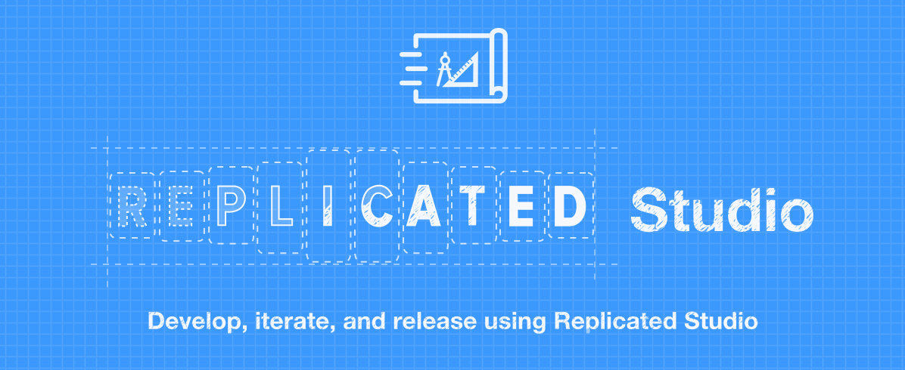

# Replicated Developer Studio

[](https://codeclimate.com/github/replicatedhq/studio)

The Replicated Developer Studio provides you with an isolated development environment, allowing you and your team to streamline your application development and remove the need to to create releases for every change you may need create along the way.

## Getting started

To get started with Studio, consult the "Development Environment" docs for the scheduler you're using:

- [Replicated Scheduler](https://help.replicated.com/docs/native/getting-started/developer-environment/)
- [Replicated + Docker Swarm](https://help.replicated.com/docs/swarm/getting-started/development-environment/)
- [Replicated + Kubernetes](https://help.replicated.com/docs/kubernetes/getting-started/development-environment/)

## Iterating on your YAML

Once Studio and Replicated have been installed and a license has been uploaded, two files will be created, `$HOME/replicated/current.yaml` and `$HOME/replicated/releases/[current-sequence-number].yaml`. (For example, if the latest release has a sequence number of 25 then `$HOME/replicated/releases/25.yaml` will be created.)

***Please note: The `current.yaml` file owner will be set to root. You may want to change this to the user you are logged in as***

After the initial installation, Replicated will no longer use the remote API for any release sequence numbers, so it is ok to generate as many releases as you need locally.

A new release can be created by simply updating `$HOME/replicated/current.yaml`. Replicated Studio monitors this file for changes and generates a corresponding file in `$HOME/replicated/releases` using the next available sequence number.

Once you have created a new release, you can go to the Admin Console and click the "Check Now" button in the Updates tile on the Replicated dashboard.


## Some finer details

- If your application YAML includes GitHub references for config files, these will not be functional. If you are using this feature, you will have to include the GitHub file inline for now.
- The Studio service does respond to requests for custom branding, console logos, and some other metadata. All of these values are static and will not be served from the upstream API. This means that your local developer console will not show your application logo or branding, but this will still work when you promote your build using the primary API service.


## Contributing

### Building the project

   ```bash
   yarn
   ```

### Running the project

   ```bash
   ./bin/replicated-studio
   ```
