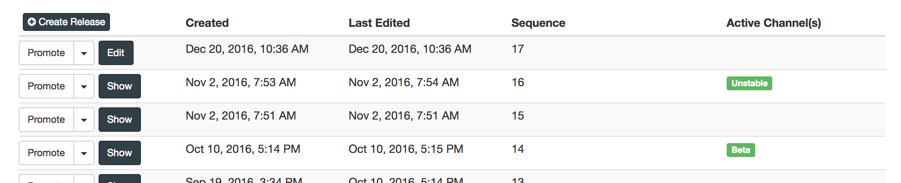

# Replicated Developer Studio

[](https://codeclimate.com/github/replicatedhq/studio)

The [Replicated Developer Studio](https://github.com/replicatedhq/studio) can provide YAML releases to Replicated for installation and updates. It is designed to streamline the development cycle to allow for local YAML changes, providing a quick way to iterate and test new versions of a Replicated application.

## What it doesn't do

- The license you use to install the application must still be valid. The Studio service only handles a few endpoints in the Replicated API, and proxies all of the others to the primary API service.
- The Studio service does respond to requests for custom branding, console logos, and some other metadata. All of these values are static and will not be served from the upstream API. This means that your local developer console will not show your application logo or branding, but this will still work when you promote your build using the primary API service.
- The Studio service does not enforce licenses to serve YAML. Any request to get YAML will be honored. The Studio service is designed to run on localhost for local development, so no license enforcements or policies were added.
- If your application YAML includes GitHub references for config files, these will not be functional. If you are using this feature, you will have to include the GitHub file inline for now.

## Getting started

1. Create a directory `./replicated` in your current directory

   ```bash
   mkdir -p ./replicated
   ```

1. Run the Studio Docker container

   ```bash
   docker run --rm -it \
     -v `pwd`/replicated:/replicated \
     -p 8006:8006 \
     replicated/studio:latest
   ```

   Studio will look in the directory `./replicated` for files with extension `.yaml` and serve these as releases. It's important that you start with the sequence number that is the latest promoted version for the channel your license is in.

## Configuring Replicated to use the local Studio API

1. Start with a new installation of Replicated, or remove any previously installed application

   ```bash
   curl -sSL https://get.replicated.com/docker | sudo bash
   ```

   *\* [Installing via the easy-install script](https://help.replicated.com/docs/distributing-an-application/installing-via-script/#basic-install)*

1. Configure Replicated by adding a `MARKET_BASE_URL` environment variable that points to the location of the Studio service. The Replicated configuration file is located at either `/etc/default/replicated` or `/etc/sysconfig/replicated` for Debian or RHEL based distributions respectively. In this example, we assume `replicated` and `replicated-studio` are running on the same host so we use the docker0 ip `172.17.0.1`. If studio is running on a separate server, use the address of that server instead.

   **Example configuration file:**
   ```bash
   RELEASE_CHANNEL=stable
   PRIVATE_ADDRESS=<snip>
   SKIP_OPERATOR_INSTALL=0
   REPLICATED_OPTS=" -e DAEMON_TOKEN=<snip> -e LOG_LEVEL=info -e NODENAME=<snip> -e MARKET_BASE_URL=http://172.17.0.1:8006"
   REPLICATED_UI_OPTS=""
   ```

1. Restart Replicated

   **Ubuntu/Debian**
   ```bash
   sudo service replicated restart
   ```

   **CentOS/RHEL/Fedora**
   ```bash
   sudo systemctl restart replicated
   ```

   *\* [Restarting Replicated](https://help.replicated.com/docs/distributing-an-application/installing-via-script/#restarting-replicated)*

1. Navigate to the on-premise admin console at https://<YOUR SERVER ADDRESS>:8080 in the browser and upload your license.

## Example

For example, here's a screenshot from a test app on Replicated.
.

My license is in the unstable channel. To start with the Studio environment, I should create a file named `/replicated/16.yaml` locally, and put my application yaml in it. Once installed, I can create a new release simply by creating a file named `/replicated/<any int higher than 16>.yaml` and clicking the Check For Updates button in Replicated. After the initial installation, Replicated will not use the real API for any sequence numbers and it's ok to generate as many as you want locally.

## Contributing

### Building the project

   ```bash
   yarn
   ```

### Running the project

   ```bash
   ./bin/replicated-studio
   ```
